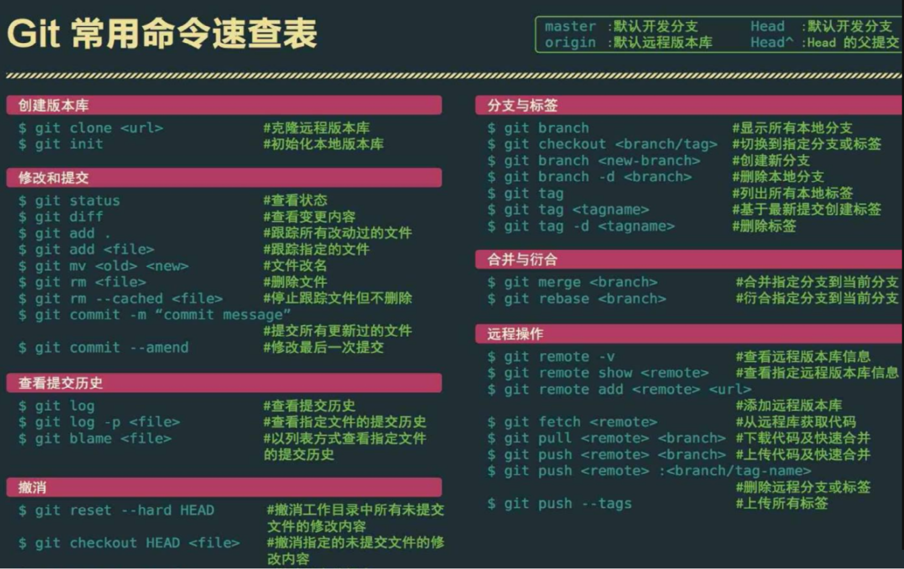
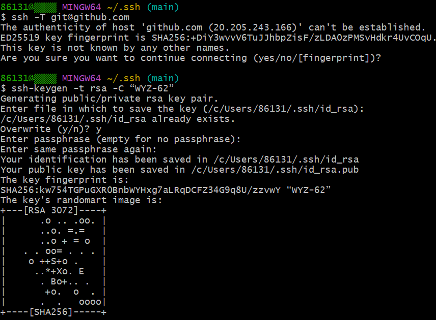
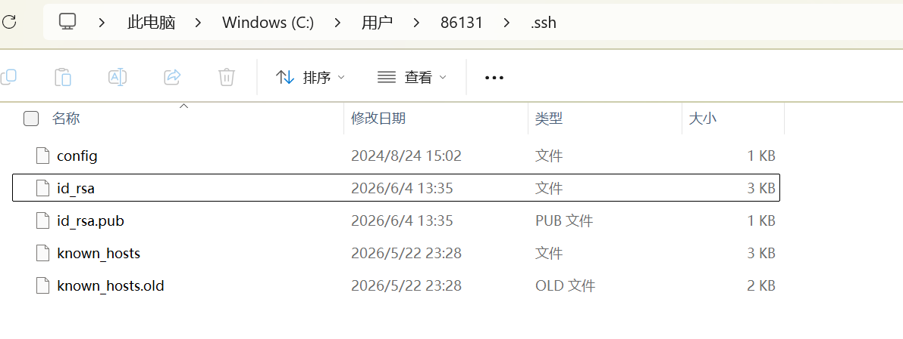
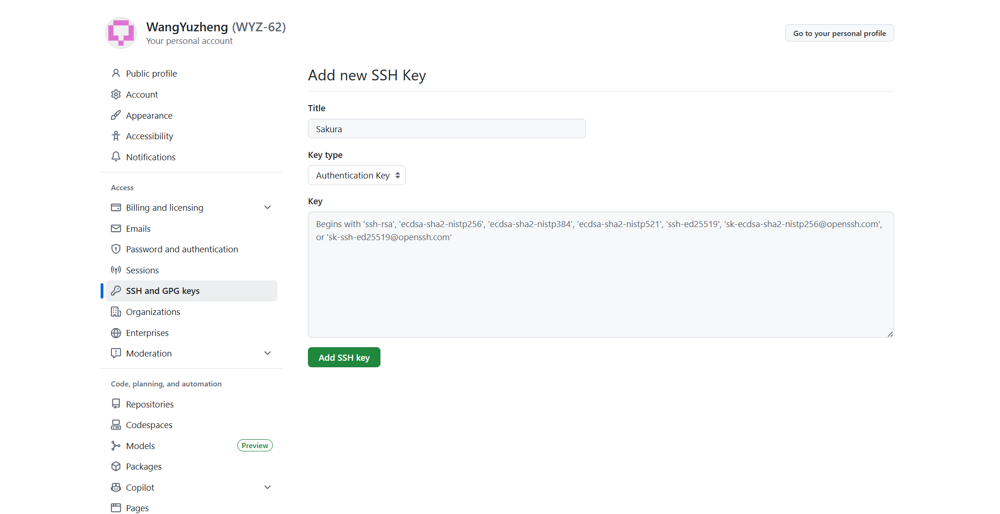
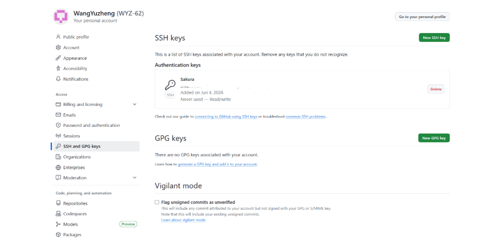

# Git 基础配置与协作常用命令

这份笔记覆盖了 Git 入门中最常用的一条主线：先完成本地配置，再打通 GitHub / Gitee 连接，接着掌握提交、分支和 PR 协作，最后处理一些日常问题。它适合作为一篇日常开发可以反复查阅的 Git 速查笔记。

## 一、首次使用 Git，先完成基础配置

第一次在新电脑上使用 Git，优先完成下面几项全局配置：

```bash
# 配置用户名（显示在提交记录中）
git config --global user.name "你的名字"

# 配置邮箱（建议与代码托管平台账号保持一致）
git config --global user.email "your.email@example.com"

# 查看当前配置
git config --list

# 将默认分支名设置为 main
git config --global init.defaultBranch main
```

这一步的核心目的是让提交记录具备明确身份，并减少后续仓库初始化时的重复配置。



### 配置时要记住的重点

- `user.name` 最好与 GitHub 或 Gitee 上展示的名称保持一致
- `user.email` 建议使用平台账号绑定的邮箱
- `init.defaultBranch` 可以统一默认主分支命名，避免新仓库出现 `master` / `main` 混用

## 二、Git 与 GitHub 绑定，核心是配置 SSH 密钥

如果希望本地免密推送到 GitHub，最常见的做法是使用 SSH 密钥对。

### 1. 先检查本地是否已有 SSH 密钥

进入终端后，可以先查看 `~/.ssh` 目录：

```bash
ls -al ~/.ssh
```

如果返回目录不存在，说明当前电脑还没有生成过 SSH 密钥，需要先创建。

成功后通常会看到类似文件：

- `id_rsa`：私钥，必须保密
- `id_rsa.pub`：公钥，用于上传到 GitHub
- 有些环境也会使用 `id_ed25519` / `id_ed25519.pub`



### 2. 理解公钥和私钥分别放在哪里

- 本地电脑保存的是私钥，用来证明“发起操作的人就是你本人”
- GitHub 账户保存的是公钥，用来识别“这个请求是不是来自已授权设备”

因此，**私钥不能泄露，公钥可以上传到平台账号中**。

打开公钥文件并复制内容：

```bash
cat ~/.ssh/id_rsa.pub
```

如果你使用的是 `ed25519`，命令改成：

```bash
cat ~/.ssh/id_ed25519.pub
```



### 3. 把公钥添加到 GitHub

登录 GitHub 后，进入：

`Settings -> SSH and GPG keys`

新增一个 SSH Key，把刚刚复制的公钥内容粘贴进去即可。



添加完成后，就建立了“本地私钥 + GitHub 公钥”的配对关系。



### 4. 验证 SSH 是否连接成功

```bash
ssh -T git@github.com
```

如果看到类似欢迎信息，说明配对成功，后续就可以正常通过 SSH 拉取和推送代码。

### 5. 这一部分最值得记住的结论

- `id_rsa` / `id_ed25519` 是私钥，只保存在本地
- `id_rsa.pub` / `id_ed25519.pub` 是公钥，需要添加到 GitHub
- 检查配置是否成功，优先用 `ssh -T git@github.com`

## 三、Git 与 Gitee 连接时，先检查身份配置

在 Gitee 场景下，通常也会先确认当前 Git 身份信息：

```bash
git config user.name
git config user.email
```

如果需要配置全局用户名和邮箱，可以使用：

```bash
git config --global user.name "Your name"
git config --global user.email "Your email"
```

这类配置和 GitHub 没有本质区别，重点仍然是：

- 用户名清晰可识别
- 邮箱与平台账号匹配

## 四、一个新仓库从初始化到首次推送的最小流程

下面这组命令可以帮助你快速完成“本地仓库初始化并推送到远程”：

```bash
git init
git add Hello.txt
git commit -m "first commit"
git remote add origin git@gitee.com:pluto52/temp.git
git push -u origin master
```

如果仓库默认主分支是 `main`，把最后一行改成：

```bash
git push -u origin main
```

### 这一流程对应的实际含义

1. `git init`：初始化本地仓库
2. `git add`：把文件加入暂存区
3. `git commit`：生成一次本地提交
4. `git remote add origin`：绑定远程仓库地址
5. `git push -u origin ...`：首次推送并建立上游分支关系

## 五、日常开发最常用的是提交命令

提交相关命令不多，但几乎每天都会用到。

```bash
# 添加文件到暂存区
git add filename.ts
git add src/
git add .

# 提交暂存区
git commit -m "提交说明"

# 已跟踪文件可直接提交
git commit -am "提交说明"
```

### 使用时的经验建议

- `git add .` 方便，但在改动较多时要先确认没有误提交无关文件
- `git commit -am` 只适用于已被 Git 跟踪的文件，**不会自动加入新文件**
- 提交说明尽量写清楚“做了什么”，方便后续排查和协作

## 六、分支操作是团队协作的基础

多人协作时，不要直接在主分支上开发，优先通过功能分支进行隔离。

```bash
# 查看分支
git branch

# 创建新分支
git branch wyz/dev

# 切换分支
git checkout wyz/dev

# 创建并切换分支
git checkout -b wyz/dev
git switch -c wyz/dev

# 切回主分支并合并
git checkout master
git merge wyz/dev

# 删除分支
git branch -d wyz/dev
```

### 建议优先记住这几条

- 新开发内容尽量在新分支完成
- `git switch -c` 和 `git checkout -b` 都能创建并切换分支
- 合并前先切回目标分支，再执行 `git merge`
- 删除分支前确认代码已经合并或不再需要

## 七、提交 PR 的标准流程可以按这个节奏走

本地开发完成后，常见流程如下：

```bash
git switch -c wyz/dev

git add Hello.java
git commit -m "添加 Hello.java 文件"

# 已跟踪文件修改后可直接提交
git commit -am "修改了 Hello.java 文件"

git push -u origin wyz/dev

git status
```

然后在代码托管平台发起 PR。

### 平台侧的 PR 提交流程

1. 登录 Gitee 或 GitHub，进入目标仓库
2. 打开 `Pull Requests` 页面
3. 点击“新建 Pull Request”
4. 选择源分支和目标分支
5. 填写标题、描述和必要说明
6. 提交 PR，等待审核与合并

### PR 描述里建议写清楚的信息

- 本次修改解决了什么问题
- 改动范围有哪些
- 是否做过测试
- 是否影响其他模块

这样审核人更容易理解你的改动背景，也能减少反复沟通。

## 八、常见问题：把不该纳入版本控制的目录移出 Git

如果像 `tmp/` 这类目录已经被提交到 Git 中，仅仅更新 `.gitignore` 是不够的，还需要把它从 Git 跟踪中移除：

```bash
# 从 Git 跟踪中移除 tmp 目录，但保留本地文件
git rm -r --cached tmp/

# 提交更改
git add .gitignore
git commit -m "移除 tmp 目录并更新 .gitignore"

# 推送远程
git push origin master
```

### 这里最容易忽略的一点

`.gitignore` 只能阻止“未来未跟踪文件”被加入版本控制，  
**对已经被提交过的文件或目录，不会自动生效。**

## 九、把这篇内容记成一套可执行流程

如果之后需要快速复习，可以按下面这条主线回忆：

1. 先完成 `user.name`、`user.email`、默认分支等基础配置
2. 再生成并配置 SSH 密钥，打通 GitHub / Gitee 连接
3. 然后掌握本地仓库初始化、首次提交和首次推送
4. 日常开发中重点使用 `add`、`commit`、`branch`、`switch`、`merge`
5. 协作时通过功能分支推送代码，并发起 PR 审核
6. 遇到忽略目录失效等问题，先区分“未跟踪文件”和“已跟踪文件”

## 十、速查清单

- 身份配置：`git config --global user.name`、`git config --global user.email`
- 查看配置：`git config --list`
- 查看 SSH 公钥：`cat ~/.ssh/id_rsa.pub`
- 验证 GitHub SSH：`ssh -T git@github.com`
- 初始化仓库：`git init`
- 添加改动：`git add .`
- 提交代码：`git commit -m "message"`
- 新建并切换分支：`git switch -c feature/xxx`
- 推送远程分支：`git push -u origin feature/xxx`
- 取消 Git 跟踪但保留本地文件：`git rm -r --cached tmp/`

## 总结

Git 入门真正重要的不是死记命令，而是把命令放回实际协作流程里理解：

- 本地身份怎么配置
- 远程仓库怎么绑定
- 日常改动怎么提交
- 团队协作怎么走分支和 PR
- 出问题时该怎么排查已跟踪文件与忽略规则

把这几个关键环节串起来，日常开发里大多数 Git 基础操作就已经够用了。
