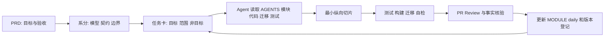
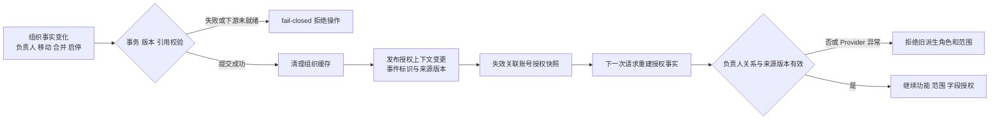

# 如何从零到一 Vibe Coding 一个项目，并长期维护

HRMS 不是一个适合“一句话生成”的项目。它表面上是员工、部门、职位、考勤、审批和薪资页面，实际却是一组相互牵连的业务规则：部门负责人决定审批人和数据范围，员工调岗会改变可见人员，薪资和身份证字段又不能因为页面做出来就被随意返回。

这篇文章基于我在 HRMS 权限体系和组织架构上的开发实践，复盘如何把 Vibe Coding 从“让 AI 快速写代码”变成一套可持续的工程方法。主线仍然是：先规划，再建立上下文；先做可验证闭环，再扩展功能；把设计目标、代码事实、迁移历史和测试结果分开记录。

## 一、先说一个失败的开发方式

刚开始使用 AI Coding Agent 时，我很容易陷入一种正反馈：想到一个功能，写一段 Prompt，页面、接口、表结构和样式很快出现，仿佛项目一直在高速前进。

但业务系统很快会进入另一个阶段。权限配置改变后，员工列表可能还在使用旧范围；部门负责人调整后，审批路由和主管数据范围没有一起变化；数据库增加字段后，已经执行过的迁移又无法安全升级。接下来就会形成循环：改完 A，B 出问题；修复 B，C 又挂了；最后只能让 AI 在已有补丁上继续打补丁。

这类项目失败，根源通常不是某一行代码写错，而是没有工程化管理：没有稳定的需求边界，AI 会自行扩展功能；没有技术方案，不同对话会分别发明实现；没有测试和进度记录，开发者也无法判断修复是否真的覆盖了问题。

HRMS 的权限和组织架构尤其容易触发这种风险。它们看起来是角色、部门、职位和按钮，实际会影响员工、审批、考勤和薪资。我的目标不是让 AI 多生成代码，而是让每次任务都明确项目要做什么、当前做到哪里、这次不能做什么、哪些规则绝不能破坏，以及完成后拿什么证明。

## 二、Vibe Coding 的本质困境

Vibe Coding 有一个很形象的比喻——抽卡游戏。

刚开始开发的时候，看着自己的想法一个个被实现，就像抽卡前期中奖概率很高，爽感拉满。但越到后面越难“中奖”：

- 上下文膨胀：代码量越大，AI 越难理解全貌，每次改动都像盲人摸象。
- 耦合蔓延：权限、组织、员工、审批相互引用，改一处可能牵动多个模块。
- 意图退化：没有 PRD、系分和决策记录，几轮对话后连开发者自己都忘了为什么这样设计。
- 红利消失：前期快速出功能的爽感过去后，维护成本开始超过功能带来的收益。

HRMS 中，部门负责人派生主管角色、授权快照失效、部门合并引用检查都是典型例子。它们不能靠某一次对话临时猜测，必须有持续存在的文档、代码和测试证据。

以上问题最终都指向同一个根源：缺乏工程化管理。这个问题可以解决，下面就是我在项目中沉淀的方案。

## 三、工欲善其事，必先利其器

工程化管理之前，先聊工具和模型的选择。

Vibe Coding 的效果首先取决于 Coding Agent 和模型能力。Codex、OpenCode 这类能够自动加载项目级 `AGENTS.md` 的 Agent，适合长期项目主流程；Cursor 适合轻量修改和代码补全；Claude Code 等自主规划能力较强的 Agent，适合复杂任务。

模型方面，我会把最强的能力用于规划和设计，把中高能力用于编码执行。需求文档、总技术文档、权限和组织系分、数据库模型和阶段实施方案属于“地基级”产出，需要强推理和人工 Review；Controller、Service、Mapper、页面、测试和文档整理，则交给稳定的中高能力编码 Agent。

HRMS 的权限三层模型、部门负责人派生角色、跨模块 Provider、Flyway 历史和失败关闭语义，都不能让编码 Agent 临场发明。相反，页面表格列、表单拆分、请求类型、组件样式和样板代码，可以让 Agent 快速完成。

工具和模型会更新，但项目规则和事实文档不会。真正重要的不是记住某个模型名称，而是即使更换 Agent，项目仍然能靠 PRD、系分、`AGENTS.md`、测试和迁移继续开发。

## 四、规划永远比写代码重要

在让 AI 写第一行代码之前，先把需求文档、技术方案和关键模块的实现文档写清楚。这些文档就是项目的地基。

HRMS PRD 负责说明 HR 专员、部门主管、财务专员和普通员工是谁，要解决哪些员工档案、入转调离、审批、考勤和薪资问题，以及部门主管只能看本部门及下属、普通员工只能看本人薪资等验收标准。

权限系分继续把目标拆成功能权限、数据范围和字段权限；组织系分则定义 `org_unit`、部门路径、负责人、五级层级、乐观锁、移动环路、合并预览和 Provider 契约。PRD 说明“做什么”，系分说明“怎样做且不能违反什么”。

不一定每个角落都要规划得事无巨细。文档写得过度详细，会让中等模型只能做机械翻译；文档过于粗略，又会让不同对话自行发明规则。我的做法是关键路径细化，边缘逻辑留给 Agent 在既有规范内发挥。

## 五、合理的数据库表设计

在没有 AI 的时代，数据库设计就是最重要的步骤之一；在 Vibe Coding 时代，它仍然如此。业务理解会直接体现在表结构上，表结构又会影响代码复杂度和后续维护成本。

用 AI 出表设计方案时，一定要人工 Review。能用一个稳定模型解决的，不要为了看起来灵活而拆成多张重复表；如果 AI 的方案不合理，要及时沟通并选择更简单、更能表达业务约束的方案。同时要考虑后续扩展，避免因为页面临时需求频繁改字段，最终被迫重构主表。

HRMS 用统一的 `org_unit` 表表达部门和职位，用 `unit_type` 区分类型。部门维护父级、路径、层级、负责人、状态和版本，职位维护所属部门、职位序列、职级范围和试用期；员工和权限模块通过稳定逻辑引用与 Facade/Provider 协作，不直接跨模块写表。

数据库 Review 至少要问四件事：这张表是否表达当前业务；能否减少重复模型；跨模块数据由谁拥有；这次变更是否能用新的 Flyway 版本从空库执行并从现有环境升级。

V15 历史核验说明了为什么不能让 AI 擅自重写迁移。仓库脚本与本地已执行事实不一致时，正确做法是恢复历史、把新变化顺延到更高版本，再验证空库初始化和已有环境升级；不能通过修改旧脚本或 `repair` 掩盖语义差异。

## 六、用 AI 开发时，先让产品可见，再用契约连接前后端

传统开发常常先写后端，再由前端接入。用 AI 时，我更倾向先让产品形态可见：把完整 PRD 交给 Agent，确认需要哪些页面、每页有哪些功能，产出页面原型或 React 结构，再用模拟数据验证列表、部门树、角色授权矩阵、筛选、弹窗和状态展示是否真正动态。

这样做有两个好处。第一，页面很快反馈产品是否符合需求，避免后端写了大量接口却发现交互方向不对。第二，模拟数据能暴露组件是否把数据写死在页面里，促使服务、类型、Hook 和组件边界尽早形成。

HRMS 的前端先行不等于前端决定安全逻辑。页面原型确定部门树需要哪些字段、角色页如何展示功能/范围/字段策略、员工列表每行有哪些操作后，再定义 API 请求、响应、错误码和权限契约。前后端可以围绕契约并行，但后端仍必须校验功能权限、数据范围和字段权限。菜单和按钮隐藏只是体验控制，不能成为授权依据。

## 七、Harness：给 Agent 一个“项目管理大脑”

模型上下文再大，也不应该成为项目唯一的记忆。随着代码量增加，把所有文件和所有历史对话塞进一次请求既不现实，也会降低准确度。我在 HRMS 中用文档和仓库规则搭建 Harness，让新对话可以通过检索恢复项目状态。

### 7.1 `AGENTS.md` 只规定 Agent 的行为

`AGENTS.md` 不重复 PRD、表结构和具体业务实现，它只规定 Agent 在仓库中如何工作。HRMS 的规则包括：

- 先读受影响的 PRD、系分、`MODULE.md`、迁移、代码和测试，再决定实现。
- 只修改当前任务涉及的内容，不顺手重构，不为未发生的需求提前抽象。
- Controller 处理 HTTP 边界，Service 承担业务和事务，Mapper 只访问本模块数据。
- 跨模块只依赖稳定接口、DTO、SPI 或 Provider，不直接调用对方 Mapper 或写对方表。
- 数据库变化必须新增递增 Flyway 迁移，已经执行的迁移不可改名或修改。
- 测试、配置、模块说明和 `Document/daily` 没有同步时，不能把“代码能运行”称为完成。
- 未经明确授权不推送远程、不发布、不无差别提交工作区文件。

它的作用只有一个：让 AI 知道项目的编码哲学和仓库边界，不需要在每次对话里重复解释。

### 7.2 按需加载、摘要压缩和任务意图识别

我会控制单次对话只推进少量相互关联的任务，完成后让 Agent 输出摘要：改了哪些文件，形成了哪些决策，哪些测试通过，还剩哪些风险。历史上下文只保留结论，不重复塞入所有探索过程。

实际工作中常用三个动作：按需加载当前任务相关文件，其余内容只通过模块索引和文档知道“存在”；对长对话做摘要，保留设计决策和未完成项；先判断当前请求是改代码、补测试、查问题还是讨论方案，再加载对应上下文。这样可以避免 Agent 在无关文件中迷路，也减少频繁上下文压缩带来的意图丢失。

### 7.3 文档治理和事实分层

当前仓库已有 PRD、权限和组织系分、模块说明、Flyway 登记、Git 与注释规范、`Document/daily`。如果从零建立项目，我会使用轻量的关联命名：

| 类别 | 命名示例 | 作用 |
| --- | --- | --- |
| REQ 需求 | `REQ-202607-01-employee-permission.md` | 明确范围、用户目标和验收 |
| PROG/日常进度 | `Document/daily/2026-07-20.md` | 记录完成、验证、阻塞和下一步 |
| BUG 缺陷 | `BUG-202607-01-auth-snapshot.md` | 记录复现、来源需求和修复证据 |
| BIZ 业务决策 | `BIZ-202607-01-department-merge.md` | 记录规则取舍和决策依据 |
| DEV 技术方案 | `DEV-202607-01-organization-provider.md` | 记录复杂模块、契约和实施顺序 |

关联规则也要固定：进度引用需求或缺陷，缺陷引用来源需求，业务决策引用受影响需求，技术方案引用模块、表和迁移。这样可以追溯、可以交接，也方便新 Agent 接手。

文档之间发生冲突时不能静默猜测。比如前端 README 曾列出 `axios`，而前端 `AGENTS.md` 要求统一使用 Umi request；应先核验真实依赖与请求实现，再修正文档和规则。PRD 表达目标，系分表达设计，`MODULE.md` 表达当前事实，Flyway 表达数据库历史，测试表达验证范围，不能把它们混成一个结论。



## 八、冻结范围，告诉 AI 这次明确不做什么

“顺手加一个功能”是 Vibe Coding 最大的诱惑。一个导出按钮可能需要新的权限、接口、字段策略、审计和测试；一个部门删除按钮可能需要员工、审批、考勤和薪资全部提供引用检查。范围越宽，Agent 的猜测越多，半成品越多，维护越困难。

因此每个版本都要写清纳入项和非目标。HRMS 权限与组织阶段纳入认证会话、角色授权、三层权限、部门树、职位、负责人、移动、合并预览和高风险能力状态；完整薪资核算、所有审批流生效编排、所有下游 Provider、全量端到端压测则进入后续 REQ，不因为“代码已经有一部分”就宣称同一阶段完成。

### Phase 0 到 Phase N

| 阶段 | 内容 | DoD |
| --- | --- | --- |
| Phase 0 | 文档体系、目录和模块边界 | PRD、系分、`AGENTS.md`、非目标和责任边界清晰 |
| Phase 1 | 后端骨架与安全基础 | 服务可启动，配置可读，空库可初始化，认证失败关闭 |
| Phase 2 | 权限核心与管理页面 | 功能、范围、字段策略真正进入后端接口和响应 |
| Phase 3 | 组织基础能力 | `org_unit`、部门树、职位、负责人和乐观锁可验证 |
| Phase 4 | 业务模块接入 | 员工、审批、考勤、薪资按契约协作，不跨表写入 |
| Phase 5 | 联调与迁移核验 | 空库和升级路径可验证，接口契约一致 |
| Phase 6 | 质量加固 | 权限失效、并发、Provider 超时、审计和回归证据完整 |
| Phase 7 | 交付与维护 | 打包、配置、部署、回滚和下一阶段文档齐备 |

每个 Phase 达到 DoD 才进入下一阶段。这个纪律不是为了增加流程，而是避免大项目一把梭，提前堆出无法验证的半成品。

## 九、一个好的 Agent 任务，应该是最小纵向切片

“实现权限模块”不是任务，“新增部门树只读接口并接入当前用户数据范围”才接近可执行任务。任务卡应包含目标、上下文、范围、非目标、既有模式、验收和交付记录：

```text
目标：本次解决什么用户或系统问题。
上下文：必须先读哪些 PRD、系分、模块、迁移、代码和测试。
范围：允许修改哪些模块、接口、表和页面。
非目标：本次明确不做什么，哪些内容形成后续 REQ。
约束：复用哪些契约，必须保持哪些安全、并发和事务规则。
验收：测试、构建、迁移校验和接口场景。
交付记录：改动、验证证据、遗留风险和下一任务。
```

例如部门删除不能只描述 `DELETE` 接口。切片应包含：校验子部门、在职员工和职位；通过 Provider 聚合跨模块引用；以 `If-Match` 做乐观锁；任一摘要缺失、重复、超时或异常时 fail-closed；事务提交后清理缓存、发布授权上下文事件；最后更新能力状态和 `Document/daily`。Agent 可以在这些边界内选择实现方式，但不能重新定义风险语义。

## 十、HRMS 实战：权限与组织架构如何证明 Harness 有效

权限体系最容易被 AI 简化成“角色加菜单”。HRMS 实际采用三层判断：功能权限决定能不能执行操作，数据范围决定可以访问哪些员工或部门，字段权限决定敏感字段可见、脱敏、隐藏还是可编辑。前端菜单和按钮只控制体验，后端接口才是最终边界。

登录采用 JWT 与 Redis Session 组合。授权快照聚合用户、显式角色、部门负责人派生角色、权限码、数据范围、字段策略和授权版本。请求处理会校验会话、账号和角色版本；快照、Provider 或字段目录解析异常时默认拒绝。

组织模块以 `org_unit` 统一表达部门和职位。部门负责人不是展示字段，而是组织事实的一部分：有效负责人可以派生 `DEPARTMENT_MANAGER` 角色，并根据部门版本解析主管范围。部门移动需要同步路径和层级，合并需要预览令牌、版本复验、员工迁移和引用阻断；组织模块不直接写员工、审批、考勤和薪资表。



这条链路中，缓存删除只是加速器，授权版本和来源版本才是正确性底线。若只删除 Redis Key，缓存删除失败、事件延迟或重复投递都可能留下旧权限；若 Provider 不可用时返回空引用，又可能误删部门数据。当前员工侧巡检和合并协作已经实现，但审批、考勤和薪资的必需 Provider 尚未齐备，因此高风险入口按能力状态禁用，服务端继续最终拒绝。

这个案例也说明了为什么不能直接把设计稿写成成果。文章中必须区分：代码和迁移已经实现什么，测试和联调已经验证什么，哪些跨模块能力仍缺少前置条件。

## 十一、长期维护靠证据链，也靠克制

每次 AI 交付后，我都会保存一条最小证据链：需求来源、设计约束、改动文件、迁移版本、测试或联调结果、遗留风险和下一任务。`Document/daily` 记录过程，`MODULE.md` 记录稳定事实，Flyway 登记记录数据库历史，Git 分支和 PR 让变更可审查、可回滚。

Git 团队协作采用从 `develop` 拉短生命周期 `feature/*` 或 `fix/*` 分支，一个需求一个分支，小步提交，合并前同步主干，PR Review 后合并。权限、路由、配置、迁移和公共模块需要负责人评审。Agent 不应无差别暂存、提交测试以外的用户修改或未经授权推送；每次原子功能都要报告提交内容和验证结果。

注释也要服务维护。公开 Controller、Service、SPI 和 Provider 说明职责、前置条件、返回和异常；权限、缓存、事务、并发、幂等和事件逻辑解释关键边界；显而易见的赋值不写重复注释。注释不是装饰，而是告诉下一次维护者为什么这里必须默认拒绝、为什么只能提交后失效、为什么不能使用旧来源版本。

Vibe Coding 做久了，最大的风险往往不是 AI 不够强，而是开发者自己的欲望：看到新库就想接入，看到新功能就想顺手实现，看到页面暂时空白就想先写一套临时逻辑。能复用成熟组件就不要重新造轮子；不在当前版本范围的能力先记 REQ；不要为了即时成就感跳过迁移、测试和模块边界。

对练手项目来说，沉淀出可复用的流程和规范就是成果；对真实业务项目，还要在立项时确认用户、价值、成本和维护责任。代码能运行只是起点，文档、范围冻结、阶段 DoD、迁移纪律和证据链才是让 AI 加速而不失控的基础。

## 结语

更好的 Vibe Coding 不是一条更长的 Prompt，也不是让一个模型把整个系统一把梭完成。人负责定义问题、冻结范围、确认业务与数据边界、审查高风险决策和验收结果；AI 负责检索上下文、在约束内编码、补全测试、整理文档和暴露遗漏。

HRMS 的实践让我看到，当 PRD、系分、`AGENTS.md`、模块说明、Flyway、测试、Git 和 `Document/daily` 形成 Harness 后，AI 才真正成为可持续的开发协作者。下一次需求到来时，团队和 Agent 都知道从哪里读起、为什么这样设计、这次可以改什么以及绝不能破坏什么，项目才算从“能被生成”变成“能够长期维护”。
