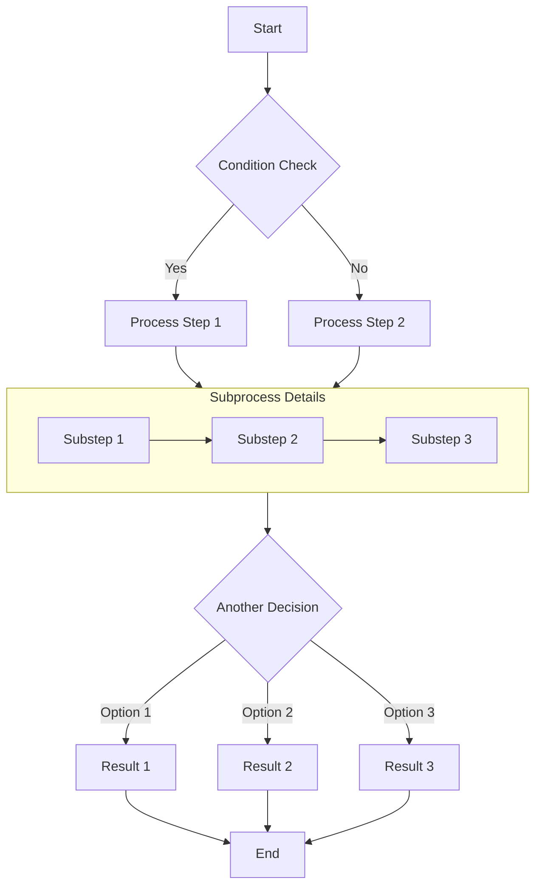
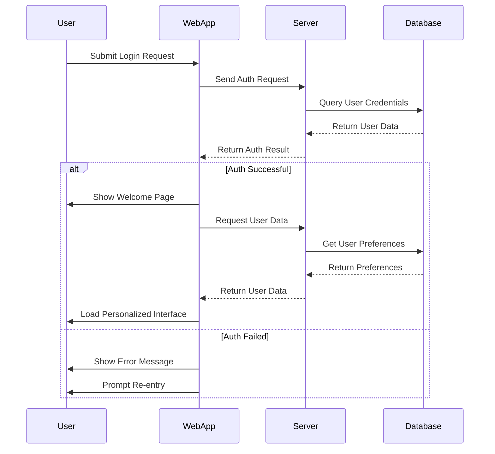
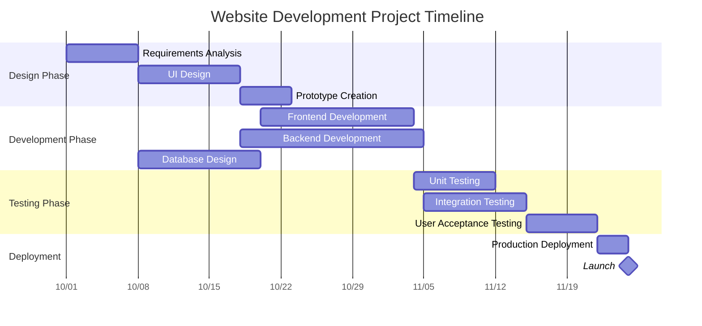
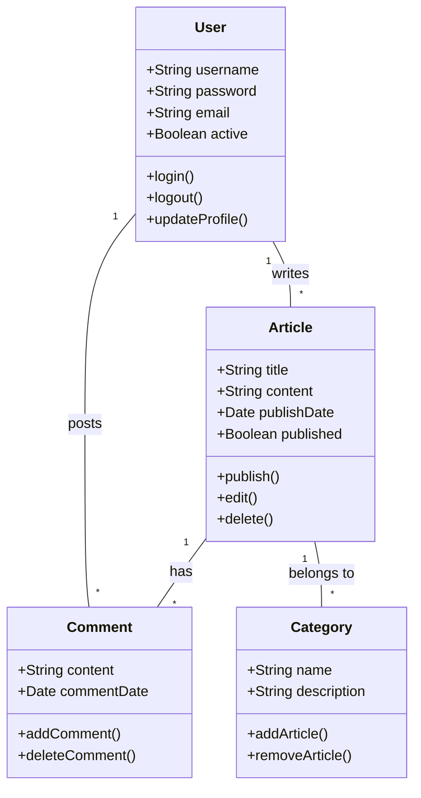
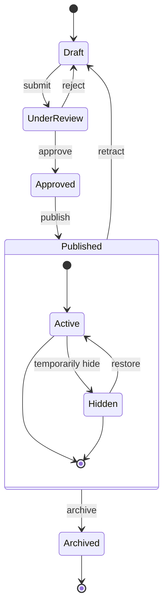
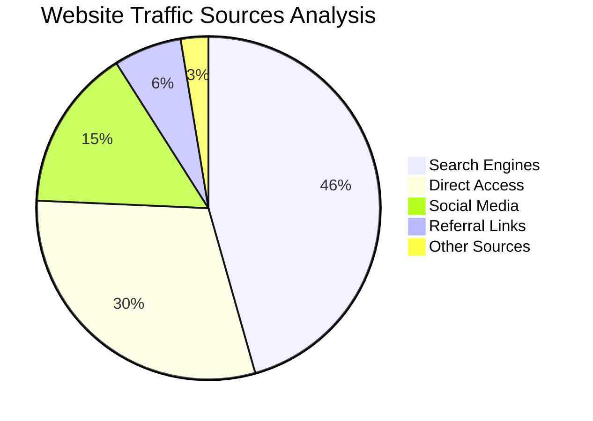

# Markdown 与 Mermaid 完整示例

本文演示如何在 Markdown 文档中使用 Mermaid 创建多种常见图表，包括流程图、时序图、甘特图、类图、状态图和饼图。

## 流程图示例

流程图非常适合表达业务流程、决策路径或算法步骤。

## 时序图示例

时序图用于展示多个对象在时间维度上的交互过程。

## 甘特图示例

甘特图适合展示项目排期、阶段划分和时间线。

## 类图示例

类图用于表示系统的静态结构，包括类、属性、方法以及它们之间的关系。

## 状态图示例

状态图适合描述对象在生命周期中会经历的不同状态及其转换过程。

## 饼图示例

饼图适合展示比例关系与百分比分布。

## 总结

Mermaid 是在 Markdown 文档里表达复杂结构和流程的高效工具。只需要在代码块中声明 `mermaid` 语言，并用简洁语法描述图表，Mermaid 就会自动把它渲染成可视化图形。

如果你经常写技术文章、项目文档或流程说明，Mermaid 会让内容更清晰，也更专业。
