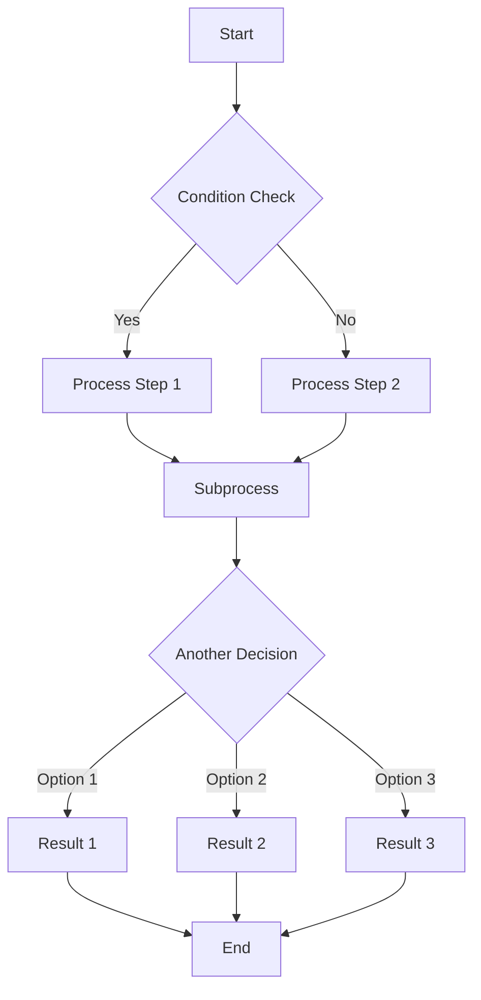
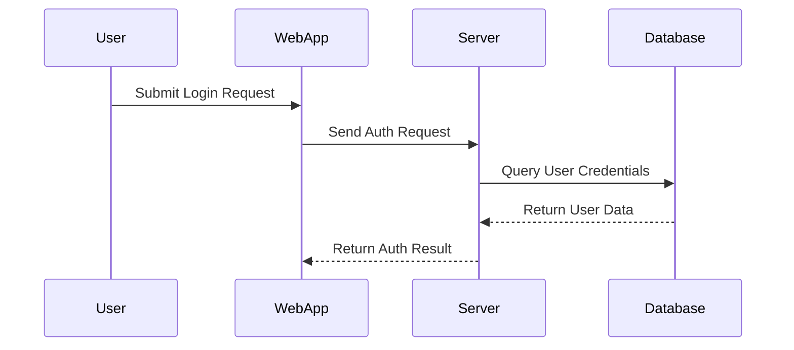
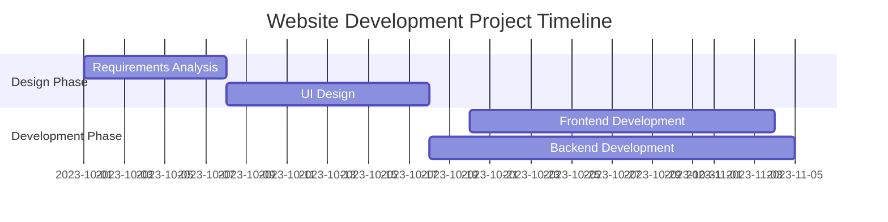
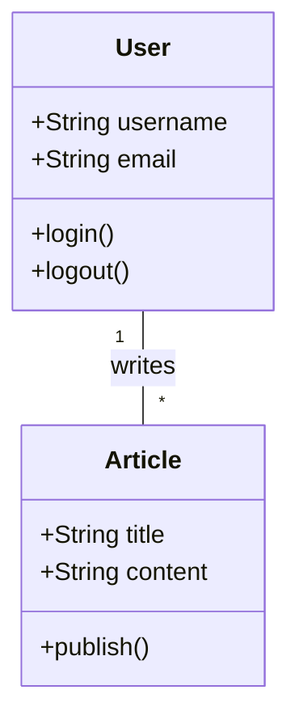
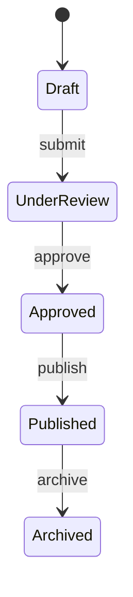
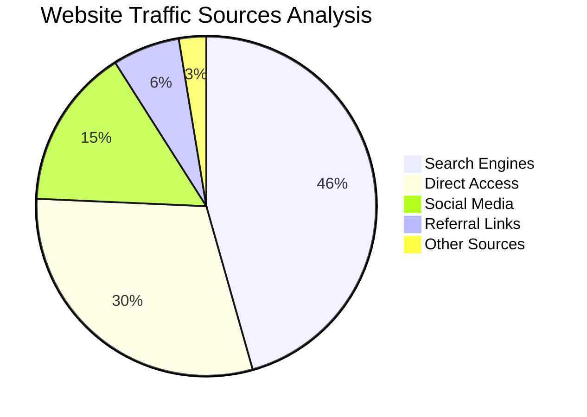

# Muzuki使用指南

这篇文章把原先分散的多篇示例文章整理成了一份可直接查阅的总指南，方便你在一个页面里快速找到最常用的内容写作方法。

## 文章 Front-matter

每篇文章最上方都可以写一段 Front-matter，用来声明标题、发布时间、描述、标签等元信息。

```yaml
---
title: My First Blog Post
published: 2023-09-09
description: This is the first post of my new Astro blog.
image: ./cover.jpg
tags: [Foo, Bar]
category: Front-end
draft: false
---
```

| 字段 | 说明 |
|------|------|
| `title` | 文章标题。 |
| `published` | 文章发布时间。 |
| `updated` | 文章更新时间。 |
| `pinned` | 是否将文章置顶到列表顶部。 |
| `priority` | 置顶文章的优先级，值越小优先级越高。 |
| `description` | 文章简介，会显示在首页或列表页卡片中。 |
| `image` | 文章封面路径。可以是网络图片、`public` 目录下的图片，或相对于当前 Markdown 文件的本地图片。 |
| `tags` | 文章标签。 |
| `category` | 文章分类。 |
| `author` | 文章作者。 |
| `sourceLink` | 文章来源或参考链接。 |
| `licenseName` | 文章内容的许可名称。 |
| `licenseUrl` | 许可协议链接。 |
| `draft` | 是否为草稿。草稿不会在文章列表中显示。 |
| `alias` | 自定义文章访问别名。 |
| `encrypted` | 是否启用文章加密。 |
| `password` | 解锁文章所需的密码。 |
| `passwordHint` | 密码提示文本。 |

## 文章文件放在哪里

文章文件默认放在 `src/content/posts/` 目录下。你也可以继续创建子目录，把文章和对应素材整理得更清晰。

```text
src/content/posts/
├── post-1.md
└── post-2/
    ├── cover.webp
    └── index.md
```

## 草稿文章

如果一篇文章还没写完，可以先把它标记成草稿：

```yaml
---
title: Draft Example
published: 2024-01-11T04:40:26.381Z
tags: [Markdown, Blogging, Demo]
category: Examples
draft: true
---
```

草稿文章不会对普通访客显示，等内容准备完成后，把 `draft` 改成 `false` 即可发布。

## 加密文章

如果你希望某篇文章只有输入密码后才能查看，可以这样写：

```yaml
---
title: My Private Post
published: 2024-01-15
encrypted: true
password: "my-secret-password"
passwordHint: "Hint: The password is my dog's name"
---
```

你也可以额外配置更易读的访问路径：

```yaml
---
title: My Special Article
published: 2024-01-15
alias: "my-special-article"
tags: ["Example"]
category: "Technology"
---
```

启用加密后，页面通常会显示标题、密码提示、输入框和解锁按钮。输入正确密码后，文章内容才会展示出来。

## Markdown 基础语法

### 段落与换行

Markdown 中，段落通常通过空行分隔。对应的 HTML 标签是 `<p>`。

```markdown
这是第一段。

这是第二段。
```

如果你只是换行而没有插入空行，Markdown 往往仍然会把它视作同一段文字。想要在同一段内强制换行，可以在行尾添加两个空格，或直接写 `<br />`。

```markdown
这一行后面有两个空格。  
所以这里会换行。

这一行使用了 HTML 标签。<br />
这里也会换行。
```

### 标题

Markdown 常见的标题写法有两种：Setext 风格和 ATX 风格。

```markdown
This is an H1
=============

This is an H2
-------------
```

```markdown
# This is an H1
## This is an H2
### This is an H3
#### This is an H4
##### This is an H5
###### This is an H6
```

### 引用

```markdown
> 这是一个引用段落。
> 你可以在每一行前都写 `>`。
```

> 这是一个引用段落。
> 你可以在每一行前都写 `>`。

### 列表

无序列表可以用 `-`、`*` 或 `+`：

```markdown
- 列表项一
- 列表项二
- 列表项三
```

有序列表使用数字加英文句点：

```markdown
1. 第一步
2. 第二步
3. 第三步
```

### 代码块

围栏代码块是最常见的写法：

````markdown
```javascript
function test() {
  console.log("notice the blank line before this function?");
}
```
````

### 分隔线

```markdown
---
***
___
```

### 表格

```markdown
| 名称 | 类型 | 说明 |
| :--- | :---: | ---: |
| title | string | 文章标题 |
| tags | string[] | 文章标签 |
| draft | boolean | 是否草稿 |
```

| 名称 | 类型 | 说明 |
| :--- | :---: | ---: |
| title | string | 文章标题 |
| tags | string[] | 文章标签 |
| draft | boolean | 是否草稿 |

## 行内元素

### 链接

```markdown
[OpenAI](https://openai.com/ "OpenAI Homepage")
```

也支持引用式链接：

```markdown
这是一个 [示例链接][id]。

[id]: https://example.com/ "Title"
```

### 强调

```markdown
*斜体文本*
**加粗文本**
***同时加粗和斜体***
```

### 行内代码

```markdown
使用 `printf()` 函数输出内容。
```

### 图片

```markdown

```

也支持引用式图片：

```markdown
![Alt text][cover]

[cover]: ./cover.webp "Image Title"
```

### 删除线

```markdown
~~这段文字会显示为删除线~~
```

### 自动链接与转义

```markdown
<https://github.com/emn178/markdown>
<example@example.com>
\*literal asterisks\*
\# not a heading
```

### 内联 HTML

对于 Markdown 语法未覆盖的结构，可以直接写 HTML。

```html
<div class="note">
  <strong>提示：</strong> 这里是一段自定义 HTML。
</div>
```

## Markdown 扩展功能

### GitHub 仓库卡片

你可以在文章中加入动态的 GitHub 仓库卡片：

::github{repo="LyraVoid/Mizuki"}

对应写法：

```markdown
::github{repo="LyraVoid/Mizuki"}
```

### 提示块（Admonitions）

当前支持的提示块类型有：`note`、`tip`、`important`、`warning`、`caution`。

:::note
这里适合放读者即使快速浏览也不应错过的信息。
:::

:::tip
这里适合补充一些能帮助读者更顺利完成操作的小建议。
:::

:::important
这里适合放与最终结果密切相关的重要说明。
:::

:::warning
这里适合提醒读者注意潜在风险或高优先级问题。
:::

:::caution
这里适合说明某个操作可能带来的负面后果。
:::

也支持自定义标题：

:::note[我的自定义标题]
这是一条带有自定义标题的提示。
:::

GitHub 风格语法同样可用：

> [!TIP]
> GitHub 风格的提示块语法也受支持。

### Spoiler 折叠文本

正文示例：:spoiler[这里是一段被折叠的 **内容**]。

## Mermaid 图表示例

### 流程图



### 时序图



### 甘特图



### 类图



### 状态图



### 饼图



## 在文章中嵌入视频

把 YouTube、Bilibili 或其他平台提供的嵌入代码直接复制到 Markdown 文件中，就可以在文章里展示视频内容。

```html
<iframe width="100%" height="468" src="https://www.youtube.com/embed/5gIf0_xpFPI?si=N1WTorLKL0uwLsU_" title="YouTube video player" frameborder="0" allowfullscreen></iframe>
```

### YouTube

<iframe width="100%" height="468" src="https://www.youtube.com/embed/5gIf0_xpFPI?si=N1WTorLKL0uwLsU_" title="YouTube video player" frameborder="0" allow="accelerometer; autoplay; clipboard-write; encrypted-media; gyroscope; picture-in-picture; web-share" allowfullscreen></iframe>

### Bilibili

<iframe width="100%" height="468" src="//player.bilibili.com/player.html?bvid=BV1fK4y1s7Qf&p=1&autoplay=0" scrolling="no" border="0" frameborder="no" framespacing="0" allowfullscreen="true" &autoplay=0></iframe>

## 总结

如果你正在维护自己的 Mizuki 博客，这篇文章可以当作一份统一入口的速查手册。平时最常用的 Front-matter、草稿、加密、Markdown、扩展语法、Mermaid 和视频嵌入，都可以直接从这里复制和调整。
